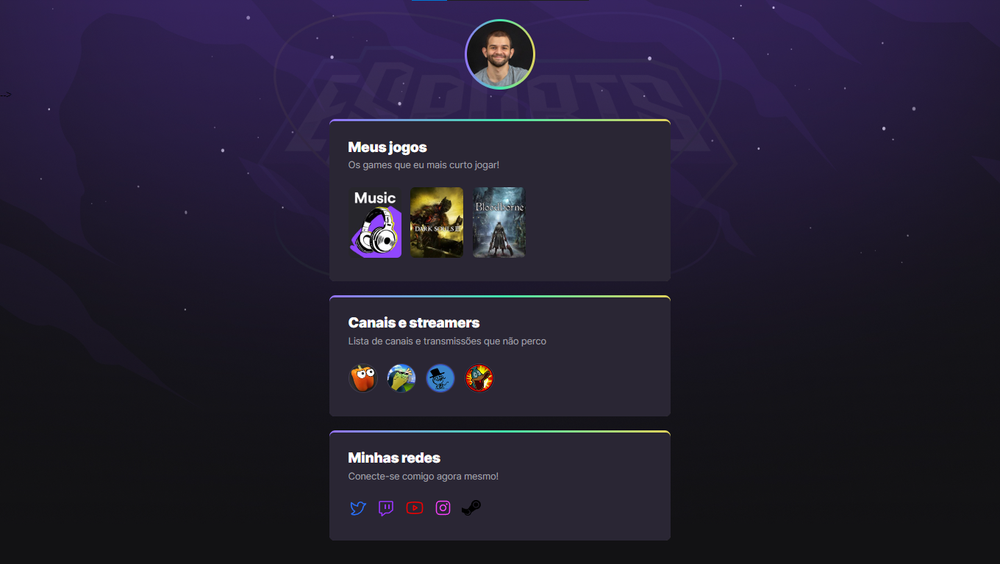

# **NLW Esports (Explorer)**
This project was a part of Rocketseat's NLW esports event.

 

## Table of contents
- [About](#about)
- [Technologies](#technologies)
- [Preview](#preview)

---
 

## About
This is the design of a webpage for a "gaming" profile.   
In this page, the user would put the games they like to play, streamers and channels they like to watch and their socials. Other gamers could visit this profile and get in touch to play together.

### [Return to the table of contents](#table-of-contents)

---
 

## Technologies
- HTML
- CSS

### [Return to the table of contents](#table-of-contents)

---
 

## Preview

### [Return to the table of contents](#table-of-contents)

---
 

### **Thanks for reading!** Diego